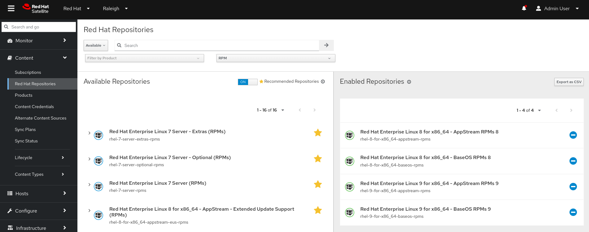
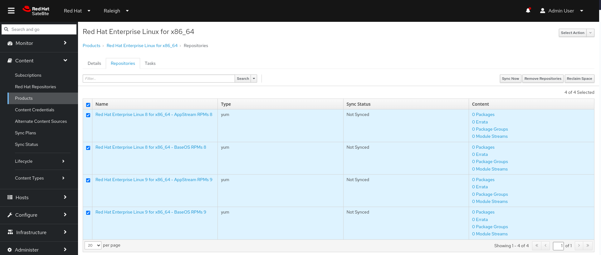
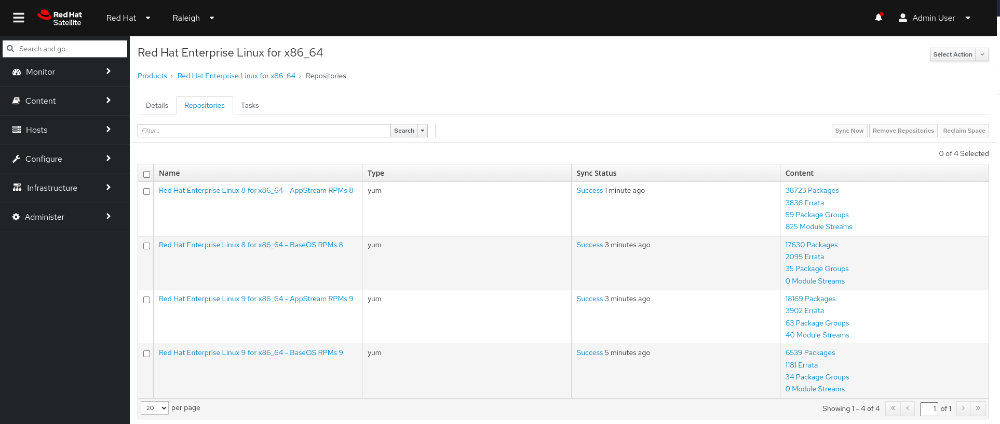

# Configuring and synchronizing content

!!! warning
    Before proceeding with any use case, the first thing to do is to generate a Manifest and upload it to satellite.
    
    

    
<i>Create the manifest and export it</i>

    
    - From the [Hybrid Cloud Console](https://console.redhat.com) home page, click Services > Subscriptions and Spend > Manifests. 
    - From the Manifests page, click Create new manifest. 
    - In the Name field, enter a unique name for the manifest. 
    - From the Type list, select the application type and version number that corresponds to your Red Hat Satellite Server. 
    - Click Create. 
    
    More details in [the documentation](https://docs.redhat.com/en/documentation/subscription_central/1-latest/html/creating_and_managing_manifests_for_a_connected_satellite_server/proc-creating-manifest-satellite-connected#proc-creating-manifest-satellite-connected)

    You can then allocate the subscriptions you want to associate to the freshly created manifest by using e [Subscription Allocation page](https://access.redhat.com/management/subscription_allocations)
    
    Then you can export the freshly created manifest withing the [manifest page in Cloud Console](https:/onsole.redhat.com/subscriptions/manifests).
    

    

    
<i>Upload manifest to Red Hat Satellite</i>

    - In the Satellite web UI, ensure the context is set to the organization you want to use.  

    - In the Satellite web UI, navigate to Content > Subscriptions and click Manage Manifest.  

    - In the Manage Manifest window, click Choose File. 

    - Navigate to the location that contains the Red Hat subscription manifest file, then click Open. 

    - Verify that in the "Content > Subscriptions" menu you see listed the subscriptions you allocated before 
    
    

    In this section we will configure and synchronize content, by enabling repositories and configuring products synchronization.

## Enabling repositories

In this first section we will enable relevant repositories for RHEL8 and RHEL9 that we will use later.

- In Red Hat Satellite Web UI go in the *Content-> Red Hat Repositories* section. 
- Toggle the **Recommended Repositories** button
- Select the following repositories:
    - Red Hat Enterprise Linux 8 for x86_64 - AppStream (RPMs) - x86_64 8
    - Red Hat Enterprise Linux 8 for x86_64 - BaseOS (RPMs) - x86_64 8
    - Red Hat Enterprise Linux 9 for x86_64 - AppStream (RPMs) - x86_64 9
    - Red Hat Enterprise Linux 9 for x86_64 - BaseOS (RPMs) - x86_64 9

The result of this operation will give you this output.

## Synchronize content

Now that the repos are in place, we can proceed populating content synchronizing our Satellite repositories with Red Hat certified content.

- In Red Hat Satellite Web UI go in the *Content-> Products* section
- Click on *Red Hat Enterprise Linux for x86_64*

> [!TIP]
> Note that no content is in sync right now, as the full *0* on the packages information shows

- Select all repositories and click on *Sync All* and grab a cup of coffee. 

> [!WARNING]
> The operation can take a while based on connection speed

- Verify that the content is correctly synchronized

## Schedule a sync plan

During the weeks, patches, bugfixes and enhancement could be released, and in order to keep your Satellite content up to date, synchronization tasks can be scheduled.

- In Red Hat Satellite Web UI go in the *Content-> Sync Plans* section. 
- On the top right of the window, click on _Create Sync Plan_
- Fill in the fields and choose a suitable schedule that works for you
- Save the plan

You will be directed to the fresh created sync plan, and you will be able to issue a sync by clicking on the _Select Action_ button and select _Run Sync Plan_

> [!NOTE]
> Sync plans start date is challenged against the current date/time. You can use a date in the past if you want the first planned sync to happen early.
