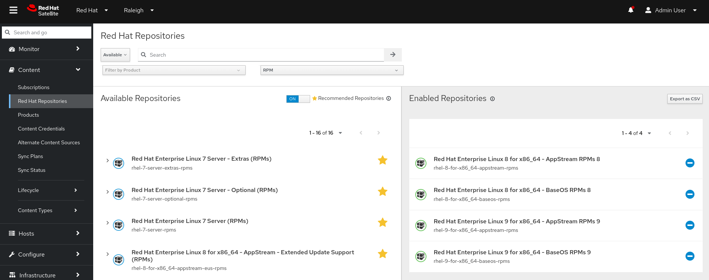
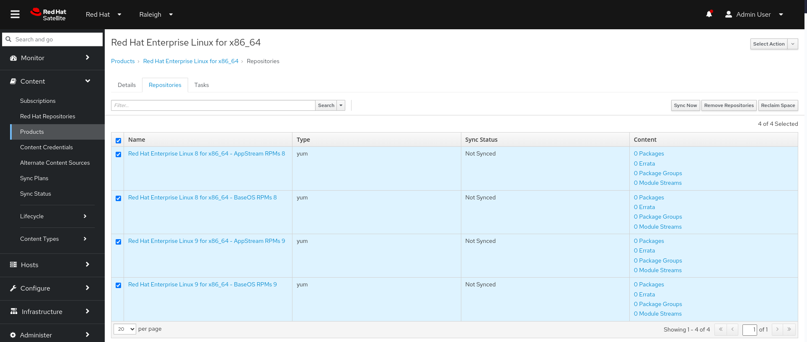
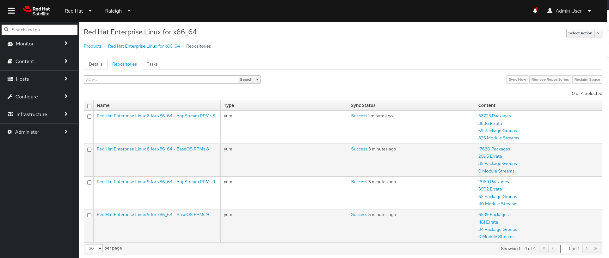

# Configuring and synchronizing content

In this section we will configure and synchronize content, by enabling repositories and configuring products synchronization.

## Enabling repositories

In this first section we will enable relevant repositories for RHEL8 and RHEL9 that we will use later.

- In Red Hat Satellite Web UI go in the *Content-> Red Hat Repositories* section. 
- Toggle the **Recommended Repositories** button
- Select the following repositories:
    - Red Hat Enterprise Linux 8 for x86_64 - AppStream (RPMs) - x86_64 8
    - Red Hat Enterprise Linux 8 for x86_64 - BaseOS (RPMs) - x86_64 8
    - Red Hat Enterprise Linux 9 for x86_64 - AppStream (RPMs) - x86_64 9
    - Red Hat Enterprise Linux 9 for x86_64 - BaseOS (RPMs) - x86_64 9

The result of this operation will give you this output.

## Synchronize content

Now that the repos are in place, we can proceed populating content synchronizing our Satellite repositories with Red Hat certified content.

- In Red Hat Satellite Web UI go in the *Content-> Products* section
- Click on *Red Hat Enterprise Linux for x86_64*

> [!TIP]
> Note that no content is in sync right now, as the full *0* on the packages information shows

- Select all repositories and click on *Sync All* and grab a cup of coffee. 

> [!WARNING]
> The operation can take a while based on connection speed

- Verify that the content is correctly synchronized

